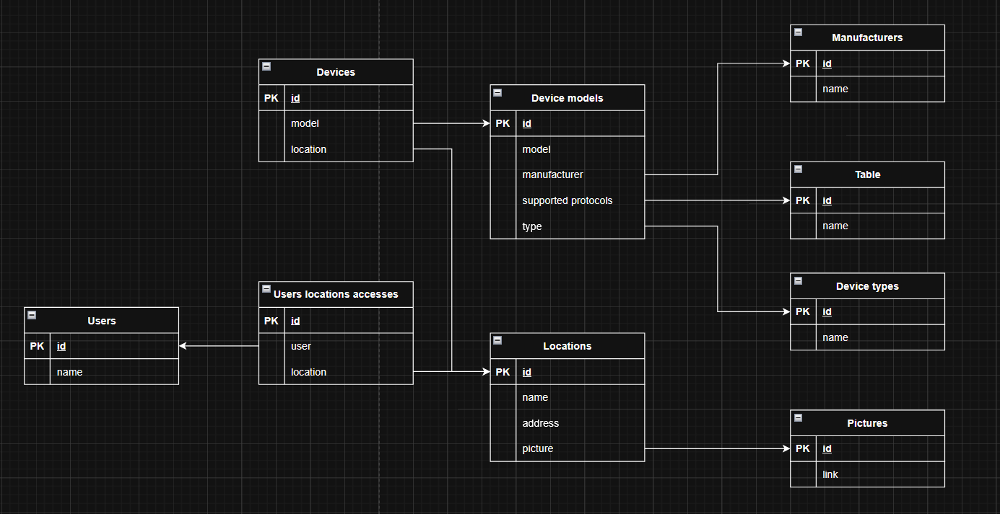

# BASEMENT

A lightweight web app to manage your smart home devices via the Aqara Home controller.

## Features

- View and control Aqara devices
- Real-time device status
- Simple, clean interface

## Technical Specification (Техническое задание)

https://ibb.co/KjQrBG3H

## ER Diagram



## Interface Mockups

[Figma](https://www.figma.com/design/d2o7xmt4P4vaCZO6hMyMB9/%F0%9F%8F%A0?node-id=101-105&t=Rky1zNGjmEvex1Fu-1)

## System Architecture

The project has two main parts: a React frontend and an Express backend.
The frontend shows smart home devices and sends requests to the backend.
The backend uses Prisma to read and write device data in a PostgreSQL database.

## API Description

The backend API runs on `http://localhost:3001`.
It provides endpoints to get devices, add a device, toggle a device state, and delete a device.

- `GET /devices` - get all devices, or filter by `location`
- `POST /devices` - create a new device
- `PATCH /devices/:id/toggle` - turn a device on or off
- `DELETE /devices/:id` - delete a device

## How to Run the Project

### 1. Clone the repository
```bash
git clone <repo-url>
cd <project-folder>
````

### 2. Install dependencies

```bash
cd backend
npm install

cd ../frontend
npm install

cd ..
```

### 3. Open two terminals

#### Terminal 1 – Backend

```bash
cd backend
node index.js
```

#### Terminal 2 – Frontend

```bash
cd frontend
npm run dev
```
